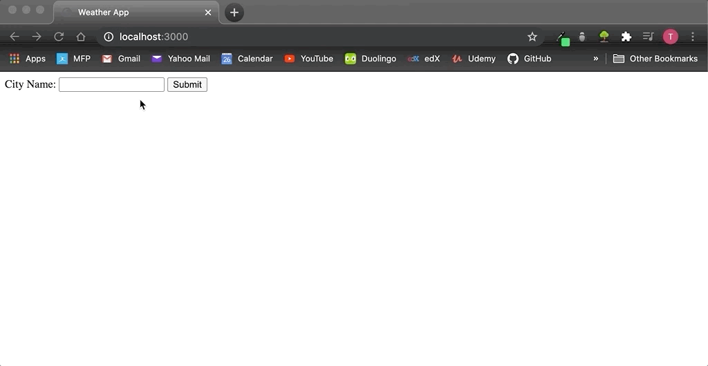

# weather-project

Weather Application that takes the users city and displays their current weather.

This project learned from Dr. Angela Yu @ London App Brewery. 
This section of the course allowed me to refresh on:
* API's
* JSON
* Express
* Working from Local Server
* GET and POST requests
* Response and Request data
